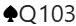
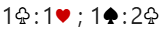

# Bridge Styler Plugin

[](https://github.com/PaulSmithTrick14/obsidian-bridge/releases/latest)
[](https://github.com/PaulSmithTrick14/obsidian-bridge/releases/latest)

This is a plugin for [Obsidian.md](https://obsidian.md) which lets you style bridge hands with auctions and inline bridge snippets in both editing mode and reading mode.  Most of the heavy lifting is done by the BBO hand viewer which is automatically embedded with the hands and/or auction that you specify.

A code block with a language of `handviewer` is used to specify zero, one, two, three or four hands.  Optionally an auction can also be specified.  If only three hands are specified (with 13 cards in each) then the fourth hand is automatically filled in.

An inline code snippet is used to display short bridge items.  The inline code snippet correctly formats a single bid, an auction, single cards, a suit of cards or multiple suits.  The suit symbols specified by the settings page are used in snippets.  A sbippet will not break across lines if possible.  Conventional spacing is provided between snippet elements. 

## Settings

The settings page is allows you to choose the styling of the suit symbols.
- Standard - Spades and Clubs are black, Hearts and Diamonds are Red.  All suit symbols are solid colour
- BBO - Mimics the colouring used by BBO.  Spades are black, Hearts red, Diamonds orange and CLubs green.  All suit symbols are solid colour
- Outline minors - Colours are as for Standard. The minor suit symbols are outlined insteadf of solid colour.


## handviewer Parameter

A parameter can be added after the `handviewer` language specifiy.  The parameter specifies the justification of the block.  `left` will left justify the display and subsequent text flows around the block being displayed.  Similar for `right`.  `centre` pushes subsequent text below the block.  If no parameter is specified then the block is `centre` justified.

For `left` and `right` jusatification, text flows around the block.  Flow can be halted by adding `||` to the end of the last paragraph which is part of the flow.  The next paragraph is guaranteed to start at the left margin, leaving blank space if required.

Example:

- ` ```handviewer` - The hand/auction which is specified will be displayed in the centre of the page
- ` ```handviewer left` - The hand/auction wil be left justified and text will flow around it.
- ` ```handviewer centre` - As if no parameter is provided

## handviewer specification
Within the handviewer block one attribute is specified per line.  The possible attributes are
- `title` - A div is added above the hand and text is formatted with h2 size but normal weight. `title=Checkback example`
- `n`, `e`, `s`, `w` - The cards held by the seat.  Spaces between suits are optional, 10 can be specified as `t`, `T` or `10` but is always displayed as `10`. An `x` can be used to indicate an unknown card(s). Fewer than 13 cards can be specified for a hand, if desired.  No more than 13 cards can be specified for a hand.  The same card cannot be specified in more than one hand.  If three full hands of 13 cards are specified then the fourth hand is automatically filled in on the diagram.  An example `n=Sakt76 Hq104 dxxx cj7`
- `nn`, `en`, `sn`, `wn` - The name displayed above the hand.  Typically, a player name or position title (declarer, dummy, etc).  If not specified then the seat name is used `North`, `South`, etc.  `sn=G Belladonna`, `nn=Dummy`
- `d` - Specifes the dealer. `d=n`. Defaults to North  Only used/shown if an auction is provided.
- `v` - Vulnerability. `v=n` (north/south only). `v=e` (east/west only), `v=b` (both sides vul), `v=-` (neither side vul).  Defaults to neither side vulnerable. Only used/shown if an auction is provided.
- `b` - Board number.  No check is made that the board number is consistent with the supplied dealer/vulnerabilty.  Further, if `d` and\or `v` are not provided but `b` then the defaults for `d`/`v` are used and *not* the values implied by the board number. Only shown if an auction is provided.
- `a` - Auction. The first call specified is made by the player in the `d` seat (North if not provided).  Each subsequent call must be specified. Spaces are ignored `a=1cp1hx rp1nd ppp` - the dealer opens with 1 Club, next player passes, partner responds 1 Heart, next player doubles (`d` can also be used), opener redoubles, Pass, 1 No Trump, Double and the auction ends.  Explanations for calls can be provided by including them between parenthesis `a=1c(3)p1h(4S)` (only letters, numbers, and dashes are supported in explanations).  Calls with explanations are shown with a yellow background, clicking on the call pops up the explanation.  Comments on calls can be made by enclosing them between curly brackets.  Comments appear below the hand/auction display.  The display of the auction stops at the first comment.  The user must press the `Next` button in the display to the next location in the auction which has a comment.  When there are no further comments all the auction is shown.
- `a` - Final contract only.  If the value provided starts with a single `-` character.  The next three characters specify the level, trump suit and declarer. (Cannot specify if contract is doubled or redoubled).  When used all four hands are shown regardless of them being specified.
- 'p' - Played cards.  Each card is specified with two characters, suit then rank. `p=c4cqckc3{Finesse failed}h4`.  Comments can be included between curly brackets (in the same style as for auctions)
- 'c' - Claim.  Specify the number of tricks claimed.  `c=10`.  The claim is shown after the last played card specified has been displayed.
- 'k' - Kibitz. Specify a seat to kibitz (or watch) `k=e`.  During the auction phase only the hand specified will be shown.  Once play commences and the opening lead has been shown then dummy is also visible. Cards played by the hand being kibitzed and dummy are shown in grey once the trick is complete.  Cards played by the other hands are only shown as they are played during the trick.
- 'tbt' - Trick By Trick. `tbt=y` displays a complete trick with each click on the `Next` button. `tbt=n` displays one card at a time with each click of the `Next` button.

A comment, in either an auction or play sequence, may start with a `+` sign.  If so, the new comment is appended to the previous one.  Suit symbols can be included in comments with `!s`, `!h`, etc

## Inline Snippet

Inline bridge snippets do not split betwen lines (if possible) and have automatic formatting applied to them.  Eg, `h` is automatically displayed as a Heart symbol using the style specified in the Settings tab.

To specify an auction, sepate each call with a `:` charqacter.  A thin space is applied either side of the `:` character.  A `;` character can be used to separate rounds of the bidding.  A larger space is applied either side of the `;` character.

Examples:
'sqt3' - 

`1c:1h;1s;2c` - 

## How to install the plugin

This is not an official Obsidian community plugin.  You won't find it by browsing the Community Plugins.  To use perfrom these one-off steps
1. Install the [Obsidian Beta Reviewers Plugin](https://github.com/TfTHacker/obsidian42-brat).
2. Run the BRAT plugin and on its settings page paste this URL into the `Beta plugin list' search box https://github.com/PaulSmithTrick14/obsidian-bridge 
3. CLick 'Add beta plugin'

You now have the Bridge Styler plugin installed.  You will be notified when new versions of the Plugin are released.

## Contributions

All contributions are welcome, just create a merge request.

Please try to create bug reports/issues that are:

- **Reproducible**: Include steps to recreate the issue
- **Specific**: Include relevant details such as possible plugin conflicts, theme conflicts etc.
- **Unique**: Please do not duplicate existing open issues, add to the existing issue
- **Scoped**: Please create a separate issue for each bug you've identified

### Maintainers

- [@trick14](https://github.com/PaulSmithTrick14)

### Contributors

[](https://github.com/PaulSmithTrick14/obsidian-bridge/graphs/contributors)

## License

Distributed under the MIT License. See `LICENSE` for more information.
